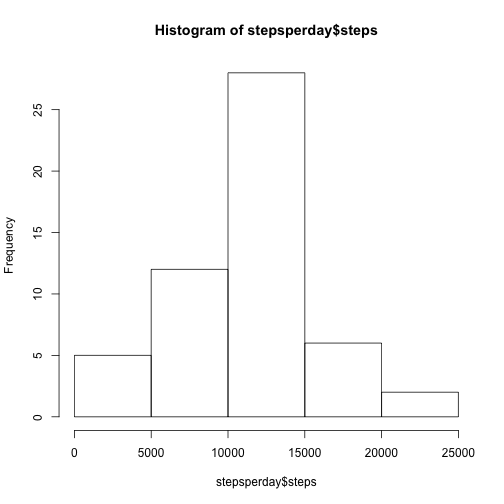
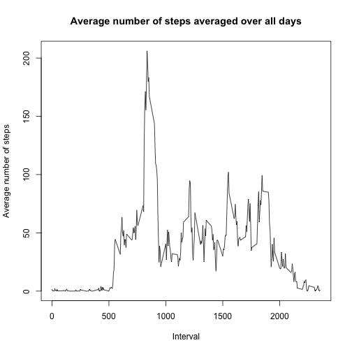
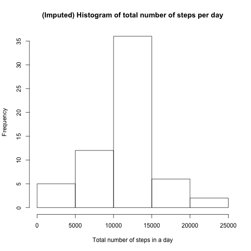
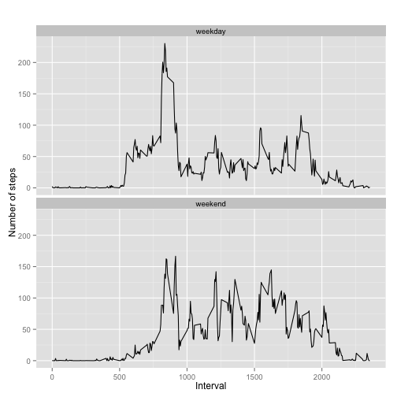

## Introduction
It is now possible to collect a large amount of data about personal movement using activity monitoring devices such as a Fitbit, Nike Fuelband, or Jawbone Up. These type of devices are part of the “quantified self” movement – a group of enthusiasts who take measurements about themselves regularly to improve their health, to find patterns in their behavior, or because they are tech geeks. But these data remain under-utilized both because the raw data are hard to obtain and there is a lack of statistical methods and software for processing and interpreting the data.

This assignment makes use of data from a personal activity monitoring device. This device collects data at 5 minute intervals through out the day. The data consists of two months of data from an anonymous individual collected during the months of October and November, 2012 and include the number of steps taken in 5 minute intervals each day.

## Data
The data for this assignment can be downloaded from the course web site:

Dataset: [Activity monitoring data](https://d396qusza40orc.cloudfront.net/repdata%2Fdata%2Factivity.zip) [52K]

The variables included in this dataset are:

**steps:** Number of steps taking in a 5-minute interval (missing values are coded as NA)

**date:** The date on which the measurement was taken in YYYY-MM-DD format

**interval:** Identifier for the 5-minute interval in which measurement was taken

The dataset is stored in a comma-separated-value (CSV) file and there are a total of 17,568 observations in this dataset.

## The assignment

#### Part 1: Loading and preprocessing the data

```r
## Download data to working directory, unzip and load
url <- "https://d396qusza40orc.cloudfront.net/repdata%2Fdata%2Factivity.zip"
download.file(url, destfile = "./factivity.zip", method="curl")
unzip ("factivity.zip", exdir = "./", overwrite=TRUE)
mydata <- read.csv("./activity.csv")
## Display some detaile regarding the data we loaded
str(mydata)
```

```
## 'data.frame':	17568 obs. of  3 variables:
##  $ steps   : int  NA NA NA NA NA NA NA NA NA NA ...
##  $ date    : Factor w/ 61 levels "2012-10-01","2012-10-02",..: 1 1 1 1 1 1 1 1 1 1 ...
##  $ interval: int  0 5 10 15 20 25 30 35 40 45 ...
```
  
#### Part 2: What is mean total number of steps taken per day?
2.1. Calculate the total number of steps taken per day

```r
## Calulate the total steps per day
stepsperday <- aggregate(steps~date,mydata,sum)
## Display some information about our result
head(stepsperday)
```

```
##         date steps
## 1 2012-10-02   126
## 2 2012-10-03 11352
## 3 2012-10-04 12116
## 4 2012-10-05 13294
## 5 2012-10-06 15420
## 6 2012-10-07 11015
```

2.2. Make a histogram of the total number of steps taken each day

```r
## A very simple histogram with default values for labels and colors
hist(stepsperday$steps)
```

 


2.3. Calculate and report the mean and median of the total number of steps taken per day

```r
## na.rm = TRUE to remove missing values from the calculations
mymean <- mean(stepsperday$steps, na.rm=TRUE)
mymedian <- median(stepsperday$steps, na.rm=TRUE)
```
The mean steps per day: 1.0766189 &times; 10<sup>4</sup>  
The median steps per day: 10765

#### Part 3: What is the average daily activity pattern?
3.1. Make a time series plot (i.e. type = "l") of the 5-minute interval (x-axis) and the average number of steps taken, averaged across all days (y-axis)

```r
# aggregate steps as interval to get average number of steps in an interval across all days
stepsbyinterval <- aggregate(steps ~ interval, mydata, mean)

# generate the line plot of the 5-minute interval (x-axis) and the average number of 
# steps taken, averaged across all days (y-axis)
plot(stepsbyinterval$interval, stepsbyinterval$steps, type='l', col=1, 
     main="Average number of steps averaged over all days", xlab="Interval", 
     ylab="Average number of steps")
```

 

3.2. Which 5-minute interval, on average across all the days in the dataset, contains the maximum number of steps?

```r
# find row id of maximum average number of steps in an interval
maxavgsteps <- which.max(stepsbyinterval$steps)

# get the interval with maximum average number of steps in an interval
stepsbyinterval[maxavgsteps, ]
```

```
##     interval    steps
## 104      835 206.1698
```

#### Part 4: Imputing missing values
4.1. Calculate and report the total number of missing values in the dataset (i.e. the total number of rows with NAs)

```r
# get rows with NA's
NARows <- mydata[!complete.cases(mydata),]

# number of rows
rowcount <- nrow(NARows)
```
There are 2304 missing values in the dataset.  
  
    
    
4.2. Devise a strategy for filling in all of the missing values in the dataset. The strategy does not need to be sophisticated. For example, you could use the mean/median for that day, or the mean for that 5-minute interval, etc.  
  
We loop across the rows of the data frame “mydata”. If the steps value is NA for a row, we find the corresponding value of interval. We then look up the steps value from the other data frame “stepsbyinterval” for this value of interval and replace the NA value with it.  

First a quick summary of the data to show NA values  

```r
summary(mydata)
```

```
##      steps                date          interval     
##  Min.   :  0.00   2012-10-01:  288   Min.   :   0.0  
##  1st Qu.:  0.00   2012-10-02:  288   1st Qu.: 588.8  
##  Median :  0.00   2012-10-03:  288   Median :1177.5  
##  Mean   : 37.38   2012-10-04:  288   Mean   :1177.5  
##  3rd Qu.: 12.00   2012-10-05:  288   3rd Qu.:1766.2  
##  Max.   :806.00   2012-10-06:  288   Max.   :2355.0  
##  NA's   :2304     (Other)   :15840
```
  
Now perform the imputation

```r
# perform the imputation
for (i in 1:nrow(mydata)){
  if (is.na(mydata$steps[i])){
    interval_val <- mydata$interval[i]
    row_id <- which(stepsbyinterval$interval == interval_val)
    steps_val <- stepsbyinterval$steps[row_id]
    mydata$steps[i] <- steps_val
  }
}
```
  
And display another summary to show NAs have been imputed

```r
summary(mydata)
```

```
##      steps                date          interval     
##  Min.   :  0.00   2012-10-01:  288   Min.   :   0.0  
##  1st Qu.:  0.00   2012-10-02:  288   1st Qu.: 588.8  
##  Median :  0.00   2012-10-03:  288   Median :1177.5  
##  Mean   : 37.38   2012-10-04:  288   Mean   :1177.5  
##  3rd Qu.: 27.00   2012-10-05:  288   3rd Qu.:1766.2  
##  Max.   :806.00   2012-10-06:  288   Max.   :2355.0  
##                   (Other)   :15840
```

4.3. Create a new dataset that is equal to the original dataset but with the missing data filled in.  
  
I am assuming this task is to create a physical dataset to disk.  

```r
## Write out the imputed dataset to a file in the working directory
write.csv(mydata, file="imputeddataset.csv")
## Do a dir to show that the file is there
dir()
```

```
##  [1] "activity.csv"       "activity.zip"       "doc"               
##  [4] "factivity.zip"      "figure"             "imputeddataset.csv"
##  [7] "instructions_fig"   "PA1_template.html"  "PA1_template.Rmd"  
## [10] "README.md"
```

  
4.4. Make a histogram of the total number of steps taken each day and Calculate and report the mean and median total number of steps taken per day. Do these values differ from the estimates from the first part of the assignment? What is the impact of imputing missing data on the estimates of the total daily number of steps?

```r
# aggregate steps as per date to get total number of steps in a day
imputedstepsbydate <- aggregate(steps ~ date, mydata, sum)

# create histogram of total number of steps in a day
hist(imputedstepsbydate$steps, main="(Imputed) Histogram of total number of steps per day", xlab="Total number of steps in a day")
```

 


```r
## Calulate the mean steps of my imputed data
imputedmean <- mean(imputedstepsbydate$steps)
## Calulate the median
imputedmedian <- median(imputedstepsbydate$steps)
```
  
The mean steps of the imputed data: 1.0766189 &times; 10<sup>4</sup>  
The median steps of the imputed data: 1.0766189 &times; 10<sup>4</sup>  
  
The median values has shifted to equal the mean.  This is likely caused by replacing NAs with the mean value. The original calculations were made with NAs already removed, otherwise the differences would have been more dramatic.  
  


#### Part 5: Are there differences in activity patterns between weekdays and weekends?
5.1. Create a new factor variable in the dataset with two levels – “weekday” and “weekend” indicating whether a given date is a weekday or weekend day.

```r
# convert date from string to Date class
mydata$date <- as.Date(mydata$date, "%Y-%m-%d")

# add a new column indicating day of the week 
mydata$day <- weekdays(mydata$date)

# add a new column called day type and initialize to weekday
mydata$day_type <- c("weekday")

# If day is Saturday or Sunday, make day_type as weekend
for (i in 1:nrow(mydata)){
  if (mydata$day[i] == "Saturday" || mydata$day[i] == "Sunday"){
    mydata$day_type[i] <- "weekend"
  }
}

# convert day_time from character to factor
mydata$day_type <- as.factor(mydata$day_type)

# aggregate steps as interval to get average number of steps in an interval across all days
imputedstepsbyinterval <- aggregate(steps ~ interval+day_type, mydata, mean)
```


5.2. Make a panel plot containing a time series plot (i.e. type = "l") of the 5-minute interval (x-axis) and the average number of steps taken, averaged across all weekday days or weekend days (y-axis). See the README file in the GitHub repository to see an example of what this plot should look like using simulated data.

```r
## Make sure our library is loaded
library(ggplot2)
## Plot my data
qplot(interval, steps, data=imputedstepsbyinterval, geom=c("line"), xlab="Interval", 
      ylab="Number of steps", main="") + facet_wrap(~ day_type, ncol=1)
```

 

